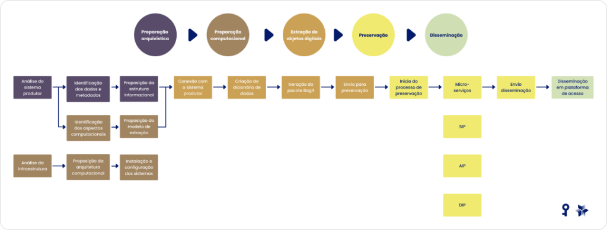
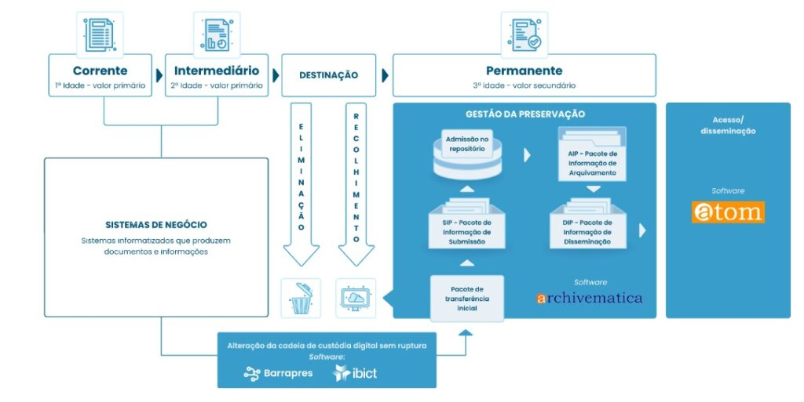
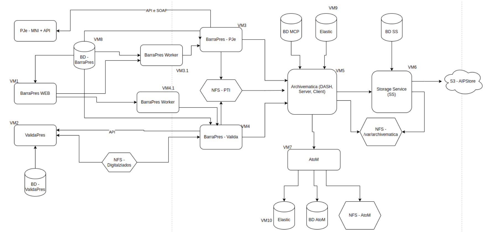

# AcervoDigitalHipatia

## O que é um Acervo Digital

Um acervo digital é uma coleção de documentos, imagens, vídeos, áudios e outros materiais armazenados eletronicamente. Ele pode incluir desde bibliotecas virtuais e arquivos históricos até coleções de museus e bases de dados institucionais. A grande vantagem é que esses materiais podem ser acessados e organizados de forma eficiente, permitindo consultas remotas e preservação de conteúdos importantes ao longo do tempo.

## IBICT

O Instituto Brasileiro de Informação em Ciência e Tecnologia (Ibict), órgão nacional de informação, unidade de pesquisa do Ministério da Ciência, Tecnologia e Inovação (MCTI), realiza estudos no campo da ciência da informação e temas relacionados. O Ibict fica sediado em Brasília e possui uma coordenação de pesquisa e pós-graduação na sede do Centro Brasileiro de Pesquisas Físicas, junto ao campus da Praia Vermelha, da UFRJ, no bairro da Urca, Rio de Janeiro.

## AcervoDigital da Justiça do Trabalho

O projeto AcervoDigital foi criado em conjunto pela IBICT e pelo TRT4 com o objetivo de criar uma solução de acervo digital para os ativos documentais da Justiça do Trabalho, baseado na plataforma RDC-arq, integrada a ferramentas como Archivematica e Atom para aprimorar a solução final.

## RDC-arq

O RDC-Arq (Repositório Digital Confiável de Arquivos) é uma plataforma projetada para garantir a preservação, integridade e acessibilidade de documentos digitais ao longo do tempo. Ele oferece um ambiente seguro para armazenamento de arquivos, aplicando políticas de acesso controlado e garantindo conformidade legal.

Além disso, o RDC-Arq conta com recursos avançados de indexação e pesquisa, facilitando a recuperação eficiente de documentos. Ele pode ser integrado a outras ferramentas, como Archivematica e ATOM, para aprimorar ainda mais a gestão documental.

## Archivematica

O RDC-Arq e o Archivematica são plataformas voltadas para a preservação digital, mas possuem diferenças importantes em suas abordagens e funcionalidades.

O RDC-Arq foca na preservação de documentos digitais dentro de um Repositório Digital Confiável. Ele garante a integridade e autenticidade dos arquivos, aplicando políticas de acesso e segurança rigorosas. É uma solução mais voltada para instituições que precisam de um ambiente seguro para armazenamento e gestão documental.

Já o Archivematica é uma plataforma de código aberto especializada na preservação digital. Ele segue padrões internacionais, como o modelo OAIS (Open Archival Information System), e permite a aplicação de estratégias de preservação digital automatizadas. O Archivematica pode ser integrado ao RDC-Arq para aprimorar a gestão de documentos arquivísticos

## ATOM

O AtoM (Access to Memory) é uma ferramenta essencial no contexto de acervos digitais, especialmente quando integrado ao RDC-Arq e ao Archivematica. Ele funciona como um sistema de descrição arquivística baseado na web, permitindo que instituições organizem e disponibilizem seus documentos de forma acessível e padronizada.

Aqui está como ele se encaixa nesse ecossistema:

RDC-Arq: Atua como um repositório digital confiável, garantindo a preservação e autenticidade dos documentos arquivísticos.

Archivematica: Responsável pela preservação digital de longo prazo, seguindo padrões internacionais como o modelo OAIS.

AtoM: Focado na descrição e acesso aos documentos, permitindo que usuários pesquisem e consultem os arquivos de maneira estruturada2.

Essas ferramentas são frequentemente usadas juntas para garantir que os documentos sejam preservados, descritos e acessíveis ao longo do tempo.

## Hipatia

O Modelo Hipátia é uma proposta desenvolvida pelo Instituto Brasileiro de Informação em Ciência e Tecnologia (IBICT) para a preservação digital arquivística. Ele busca integrar os ambientes de gestão, preservação e acesso, garantindo a autenticidade dos documentos ao longo do tempo2.

O modelo segue normativas nacionais e internacionais sobre boas práticas de preservação digital, permitindo que instituições mantenham seus acervos digitais de forma segura e acessível. Além disso, ele é baseado em softwares livres, o que facilita sua implementação em diferentes cenários institucionais

## Diagramas Hipatia

## Diagrama RDC-arq

## CONTATO

O principal contato deste projeto no TRT4 é o Sr. Alex Risicato Fagundes <afagundes@trt4.jus.br>

